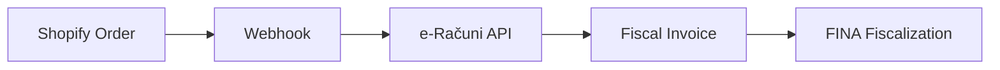

<style>
:root {
  --accent: #60a5fa;
  --accent-light: #93c5fd;
}

.slidev-layout {
  background: linear-gradient(135deg, #0f1729 0%, #1a2744 40%, #1e3a5f 100%);
  position: relative;
  overflow: hidden;
}

.slidev-layout::before {
  content: '';
  position: absolute;
  top: -50%;
  right: -20%;
  width: 600px;
  height: 600px;
  background: radial-gradient(circle, rgba(96, 165, 250, 0.08) 0%, transparent 70%);
  border-radius: 50%;
  z-index: 0;
}

.slidev-layout::after {
  content: '';
  position: absolute;
  bottom: -30%;
  left: -10%;
  width: 400px;
  height: 400px;
  background: radial-gradient(circle, rgba(147, 197, 253, 0.06) 0%, transparent 70%);
  border-radius: 50%;
  z-index: 0;
}

.slidev-layout > * {
  position: relative;
  z-index: 1;
}

.slidev-layout h1 {
  color: #ffffff !important;
  opacity: 1 !important;
  font-weight: 700 !important;
  letter-spacing: -0.02em;
  text-shadow: none;
}

.slidev-layout h2 {
  color: var(--accent-light) !important;
  opacity: 1 !important;
  font-weight: 400 !important;
  text-shadow: none;
}

.slidev-layout h3,
.slidev-layout p,
.slidev-layout li,
.slidev-layout strong,
.slidev-layout a,
.slidev-layout span {
  color: #e2e8f0 !important;
  opacity: 1 !important;
  text-shadow: none;
}

.slidev-layout strong {
  color: #ffffff !important;
}

.slidev-layout code {
  color: var(--accent-light) !important;
  opacity: 1 !important;
  background: rgba(96, 165, 250, 0.1) !important;
  border: 1px solid rgba(96, 165, 250, 0.2) !important;
  border-radius: 4px;
  padding: 0.1em 0.4em;
  font-size: 0.9em;
  text-shadow: none;
}

.slidev-layout .my-auto {
  opacity: 1 !important;
}

.slidev-page-1 .slidev-layout {
  background: linear-gradient(135deg, #0f1729 0%, #1a2744 40%, #1e3a5f 100%) !important;
}

.slidev-code-wrapper {
  background: rgba(0, 10, 30, 0.6) !important;
  backdrop-filter: blur(12px);
  border-radius: 12px;
  border: 1px solid rgba(96, 165, 250, 0.15) !important;
  padding: 1.25rem;
  box-shadow: 0 4px 24px rgba(0, 0, 0, 0.3);
}

.slidev-layout ul {
  list-style: none;
  padding-left: 0;
}

.slidev-layout ul li {
  padding-left: 1.5em;
  position: relative;
  margin-bottom: 0.5em;
}

.slidev-layout ul li::before {
  content: '▸';
  position: absolute;
  left: 0;
  color: var(--accent) !important;
  font-weight: bold;
}

.slidev-layout img {
  border-radius: 12px;
  border: 1px solid rgba(96, 165, 250, 0.2);
  box-shadow: 0 8px 32px rgba(0, 0, 0, 0.4);
}

.accent-line {
  width: 60px;
  height: 3px;
  background: linear-gradient(90deg, var(--accent), var(--accent-light));
  border-radius: 2px;
  margin: 0.75rem auto;
}

.badge {
  display: inline-block;
  padding: 0.25em 0.75em;
  border-radius: 999px;
  font-size: 0.75em;
  font-weight: 600;
  letter-spacing: 0.05em;
  text-transform: uppercase;
}

.badge-before {
  background: rgba(239, 68, 68, 0.2);
  border: 1px solid rgba(239, 68, 68, 0.4);
  color: #fca5a5 !important;
}

.badge-after {
  background: rgba(34, 197, 94, 0.2);
  border: 1px solid rgba(34, 197, 94, 0.4);
  color: #86efac !important;
}

.mermaid {
  background: rgba(0, 10, 30, 0.4) !important;
  border-radius: 12px;
  border: 1px solid rgba(96, 165, 250, 0.15);
  padding: 1rem;
}
</style>

<div class="flex flex-col items-center justify-center h-full">

# Kazinoti & Komenda

<div class="accent-line"></div>

## Technical Challenges & Solutions

<div class="mt-8 text-lg tracking-widest" style="color: rgba(148, 163, 184, 1) !important;">
Prismic · Shopify · e-Računi · Vercel
</div>

</div>

<!--
Real-world technical challenges from e-commerce development.
Focus on problem-solving approach and practical solutions.
-->

---

# Agenda

<div class="accent-line" style="margin: 0.75rem 0;"></div>

- **Prismic Imgix color degradation**
- **Shopify fiscalization integration**
- **Vercel cache invalidation**

<!--
Three distinct technical challenges across different parts of the stack:
CDN optimization, payment processing, and deployment infrastructure.
-->

---

# Prismic Image Problem

<div class="accent-line" style="margin: 0.75rem 0;"></div>

- **Imgix CDN auto-optimization degraded colors**
- **Chroma subsampling artifacts**
- **Visible quality loss on product images**

<!--
Prismic uses Imgix CDN which applies automatic optimizations.
Default settings prioritize file size over color accuracy.
This became a critical issue for e-commerce product photography.
-->

---

# Visual Impact

<div grid="~ cols-2 gap-8" class="mt-4">

<div class="text-center">
<span class="badge badge-before">Before</span>


</div>

<div class="text-center">
<span class="badge badge-after">After</span>


</div>

</div>

<!--
Side-by-side comparison shows the dramatic difference.
Left: default Imgix processing with visible color degradation.
Right: optimized parameters preserving original color fidelity.
-->

---

# Imgix Fix

<div class="accent-line" style="margin: 0.75rem 0;"></div>

```tsx
imgixParams={{
  auto: null,
  fm: 'jpg',
  chromasub: 444,
  cs: 'origin',
}}
```

<div class="mt-4">

- `chromasub: 444` — full color resolution, no subsampling
- `cs: 'origin'` — preserve original color space

</div>

<!--
Solution disables automatic processing and forces high-quality settings.
chromasub 444 means full color resolution (no 4:2:0 compression).
cs: origin preserves the original image color space.
-->

---

# Shopify ↔ e-Računi

<div class="accent-line" style="margin: 0.75rem 0;"></div>

**Goal:** Automatic fiscal invoice generation



<!--
Integration flow: Shopify order triggers webhook, which calls e-Računi API
to generate and fiscalize the invoice through FINA system.
-->

---

# Fiscalization Requirements

<div class="accent-line" style="margin: 0.75rem 0;"></div>

**Croatia 2026 mandate:**

- **Mandatory from 1.1.2026**
- **B2B:** provider certificate allowed
- **B2C:** own digital certificate required

<!--
Croatian fiscalization became mandatory in 2026.
B2B transactions can use service provider's certificate.
B2C requires company's own FINA-issued digital certificate.
-->

---

# e-Računi Setup

<div class="accent-line" style="margin: 0.75rem 0;"></div>

- **Fiscally registered business unit**
- **Warehouse configuration**
- **FINA certificate integration**
- **Invoice fiscalization enabled**

<!--
e-Računi platform requires proper business registration.
Warehouse must be configured for inventory tracking.
FINA certificate enables legal fiscalization.
-->

---

# Shopify Webhook Sync

<div class="accent-line" style="margin: 0.75rem 0;"></div>

<div grid="~ cols-2 gap-8" class="mt-4">

<div>

- **Default:** syncs every 1 hour
- **With webhook:** near-instant sync
- **Testing:** Bogus Gateway for dev payments

</div>

<div>


</div>

</div>

<!--
By default, e-Računi polls Shopify every hour for new orders.
Webhook integration triggers immediate invoice generation.
Shopify dev stores use Bogus Gateway to simulate payments.
Mapped "BOGUS" payment method to card payment type for testing.
-->

---

# Vercel Cache Problem

<div class="accent-line" style="margin: 0.75rem 0;"></div>

<div class="mt-6">

**Issue:** Static pages cached, CMS updates not visible

</div>

<div class="mt-4">

**Solution:** Webhook-triggered revalidation

</div>

<!--
Vercel's edge caching is aggressive for static pages.
Prismic CMS updates wouldn't appear until manual redeployment.
Needed automated cache invalidation on content changes.
-->

---

# Prismic Webhook

<div class="accent-line" style="margin: 0.75rem 0;"></div>

<div grid="~ cols-2 gap-8" class="mt-4">

<div>

- Prismic webhook → Vercel API
- Cache invalidation endpoint
- IP whitelist for Prismic

</div>

<div>


</div>

</div>

<!--
Configured Prismic to call Vercel's revalidation API on content publish.
Created secure endpoint that invalidates specific page caches.
Whitelisted Prismic's IP addresses for security.
-->

---

<div class="flex flex-col items-center justify-center h-full text-center">

# Thank You

<div class="accent-line" style="margin: 1rem auto;"></div>

<div class="text-2xl mt-4" style="color: var(--accent-light) !important;">
Questions?
</div>

</div>
